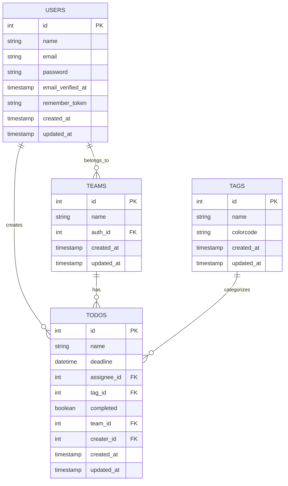

# タスク管理アプリケーション

このプロジェクトは、Laravelを使用して構築されたシンプルなタスク管理アプリケーションです。

## 機能

- ユーザー認証
- タスクの作成、編集、削除
- タスクの完了状態の切り替え
- チームの作成と管理
- タスクへのタグ付け

## データベース構造

以下はアプリケーションのデータベースER図です：



## インストール

1. リポジトリをクローンします：
   ```
   git clone [リポジトリのURL]
   ```

2. 依存関係をインストールします：
   ```
   composer install
   npm install
   ```

3. .envファイルを作成し、データベース設定を行います。

4. アプリケーションキーを生成します：
   ```
   php artisan key:generate
   ```

5. データベースマイグレーションを実行します：
   ```
   php artisan migrate
   ```

6. （オプション）シードデータを追加します：
   ```
   php artisan db:seed
   ```

## 使用方法

1. 開発サーバーを起動します：
   ```
   php artisan serve
   ```

2. ブラウザで `http://localhost:8000` にアクセスします。

3. アカウントを作成またはログインしてアプリケーションを使用開始します。

## 開発

- Tailwind CSSを使用してスタイリングしています。
- Font Awesome for Laravelを使用してアイコンを表示しています。

## ライセンス

このプロジェクトはMITライセンスの下で公開されています。詳細については[LICENSE](LICENSE)ファイルを参照してください。